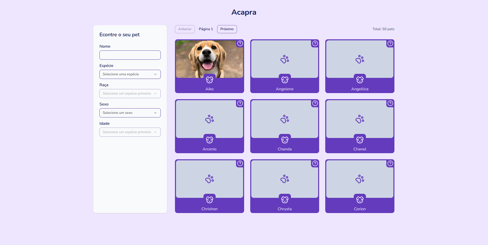
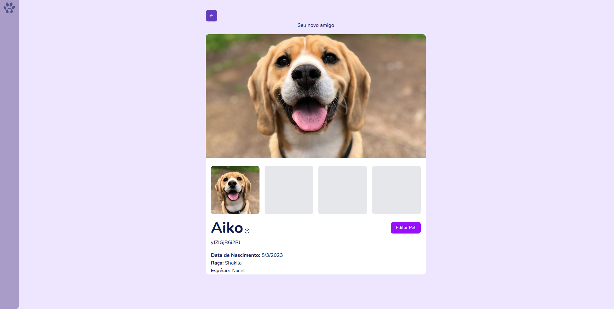

# Acapra Site

Acapra Site is a web application that allows users to create, edit, and manage pets.






## Getting Started

1. Clone the repository

```bash
git clone https://github.com/viniciusCestarii/acapra-site.git
cd acapra-site
```

2. Pull the submodule modular-pets

```bash
git submodule update --init --recursive apps/api
```

3. Install the dependencies

```bash
bun install
```

4. Create .env files

```bash
cd apps/api
cp .env.example .env
cd ../..

cd apps/web
cp .env.example .env
cd ../..
```

5. Apply database migrations

```bash
cd apps/api
bun migrate
cd ../..
```

6. Run the application

```bash
bun dev
```

7. Open the application in your browser

```bash
open http://localhost:3000
``` 